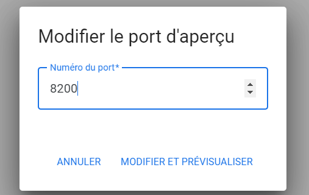

# Lab - Vault Installation & Configuration

<walkthrough-tutorial-duration duration="30.0"></walkthrough-tutorial-duration>

## Description

* Task 1: Configure and setup Vault
* Task 2: Connect to Vault UI
* Task 3: Explorer K/V Secrets Engine

## Clean your env

```bash
chmod +x ../cleanup-install.sh
../cleanup-install.sh
```

## Install Vault with Package Manager

```bash
sudo apt update && sudo apt install gpg

curl -fsSL https://apt.releases.hashicorp.com/gpg | sudo apt-key add -

sudo apt-add-repository "deb [arch=amd64] https://apt.releases.hashicorp.com $(lsb_release -cs) main"

sudo apt update
```

Install Vault

```bash
sudo apt install vault=1.16.3-1
```

Start Vault server (with config)

```bash
sudo vault server -config=vault.hcl 2>&1 &
```

```bash
export VAULT_ADDR='http://127.0.0.1:8200' 
```




## Init Vault

Get Help on `vault operator init` command: 

```bash
vault operator init -h
```

> Common Options:
> 
>  -key-shares=<int>
>      Number of key shares to split the generated root key into. This is the
>      number of "unseal keys" to generate. This is aliased as "-n".
>
>  -key-threshold=<int>
>      Number of key shares required to reconstruct the root key. This must be
>      less than or equal to -key-shares. This is aliased as "-t".

For the purpose, we will use 1 key share and 1 key threshold, open in a new shell

```bash
export VAULT_ADDR='http://127.0.0.1:8200' 
vault operator init -key-shares=1 -key-threshold=1 > key.txt
```

> refresh UI


Unseal Vault

```bash
vault operator unseal $(grep 'Key 1:' key.txt | awk '{print $NF}')
```

Login to Vault

```bash
vault login $(grep 'Initial Root Token:' key.txt | awk '{print $NF}')
```

## Connect to UI

Retreive root token from `key.txt` file

> like: `Initial Root Token: hvs.QDMgrG8WjFm9sQIoHay3zx7Z`


## Explore K/V Secrets Engine

Create a K/V secret engine with UI

- Click `Enable new Engine`
- Select `KV`
- Let default path and default version (Method Options)
- Click `Enable Engine`

Now create your first secret

- Create Secret
- Set the path: `Path for this secret` > `test`
- Set `key / Value`

Test Vault security

```bash
sudo apt install tree
```

```bash
sudo tree /opt/vault/data/logical
```

```
/opt/vault/data/logical
├── 6e3d6b47-eb2e-287c-3d8a-2d4b93123c22
│   └── 0dc5e068-722e-9897-c4f6-cddb340fccd8
│       ├── archive
│       │   └── _metadata
│       ├── _config
│       ├── metadata
│       │   └── _5kKMLHGJh1tPJ5Z75eC7oJMnKbnZszUsj0YWRSDlvAu1CfgkBN8AqNHXPDMqVT
│       ├── policy
│       │   └── _metadata
│       ├── _salt
│       ├── _upgrading
│       └── versions
│           └── 457
│               └── _211f9ca7d28d51418a45effceaea489748122252230e869a2ebd1878939c0
└── 998c4b69-0f4f-2f3e-7d4f-4801524d6006
    ├── _casesensitivity
    ├── oidc_provider
    │   ├── assignment
    │   │   └── _allow_all
    │   └── provider
    │       └── _default
    └── oidc_tokens
        ├── named_keys
        │   └── _default
        └── public_keys
            ├── _85e843cb-47f5-096c-47a4-ec4895d368ed
            └── _c1b5a5cb-93db-7396-ba9e-b964205b3e9e

14 directories, 13 files
```

navigate in folder

```bash
sudo cat /opt/vault/data/logical/6e3d6b47-eb2e-287c-3d8a-2d4b93123c22/0dc5e068-722e-9897-c4f6-cddb340fccd8/versions/457/_211f9ca7d28d51418a45effceaea489748122252230e869a2ebd1878939c0

echo "AAAAAQLEdUIhb2Jn0k4arkffN1gQPL0tLDQhKfrw0T7bTJrsNjzEtmJ+vq3KOrXa80KPOow1k23/xZSqzT3sYQ==" | base64 -d
```

## Optional Step

enable Vault audit

```bash
sudo mkdir -p /opt/vault/audit
vault audit enable file file_path=/opt/vault/audit/audit.log
```

ensure audit log is active

```bash
sudo tail -f /opt/vault/audit/audit.log
```

## Clean Up (only at the end of the training)

Stop vault server

```bash
kill %1
```